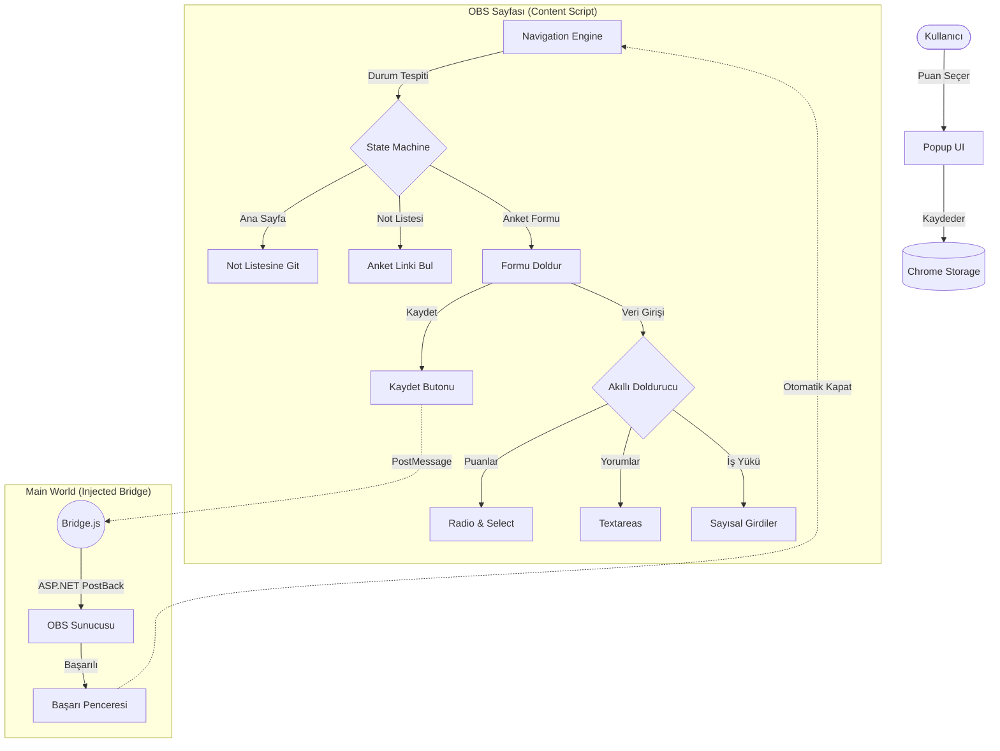

# Fırat OBS Otomatik Anket Çözücü v3.2.2 🚀

Fırat Üniversitesi Öğrenci Bilgi Sistemi (OBS) üzerindeki zorunlu anketleri saniyeler içinde, tam otomatik bir akışla dolduran Manifest V3 tabanlı, modern bir tarayıcı eklentisidir.

## ✨ Öne Çıkan Özellikler

- **Tam Otomasyon**: Sayfalar arası geçiş yapar, anketleri doldurur ve kaydeder. Kullanıcı müdahalesi gerektirmez.
- **Dinamik Navigasyon (v3.2.2)**: DOM tabanlı akıllı yönlendirme sistemi ile "Not Listesi" ve anket linklerini hatasız bulur.
- **Akıllı Form Doldurucu**:
  - Likert ölçeklerini (Katılıyorum/Katılmıyorum) metin analizi ile algılar.
  - **AKTS/İş Yükü** tablolarındaki sayısal alanları (Saat/Gün) otomatik hesaplar.
  - Yorum alanlarına anlamlı varsayılan mesajlar girer.
- **Bridge Architecture (CSP Bypass)**: Modern tarayıcı güvenlik duvarlarını aşarak `__doPostBack` gibi ASP.NET fonksiyonlarını doğrudan tetikler.
- **Güvenli Mod**: Sonsuz döngüleri engelleyen akıllı bekleme ve yeniden deneme mekanizması.

## 🏗️ Mimari ve Akış Diyagramı

Proje, OBS'nin karmaşık iframe yapısı ve ASP.NET'in state yönetimi (Postback) dikkate alınarak tasarlanmıştır.

## 🛠️ Kurulum Rehberi

1.  Repoyu indirin (Code -> Download ZIP).
2.  Tarayıcınızda `chrome://extensions/` adresine gidin.
3.  Sağ üstteki **Geliştirici Modu**'nu açın.
4.  **Paketlenmemiş öğe yükle** butonuna basıp klasörü seçin.

## ⚡ Kullanım

1.  OBS sistemine giriş yapın.
2.  Eklenti ikonuna tıklayıp istediğiniz puanı (1-5) seçin.
3.  Eklenti otomatik olarak çalışmaya başlayacaktır. Arkanıza yaslanın! ☕

## 📄 Lisans

Bu proje **MIT Lisansı** ile lisanslanmıştır. Tamamen açık kaynaklıdır ve eğitim/hobi amaçlı geliştirilmiştir. Ticari bir amacı yoktur.
