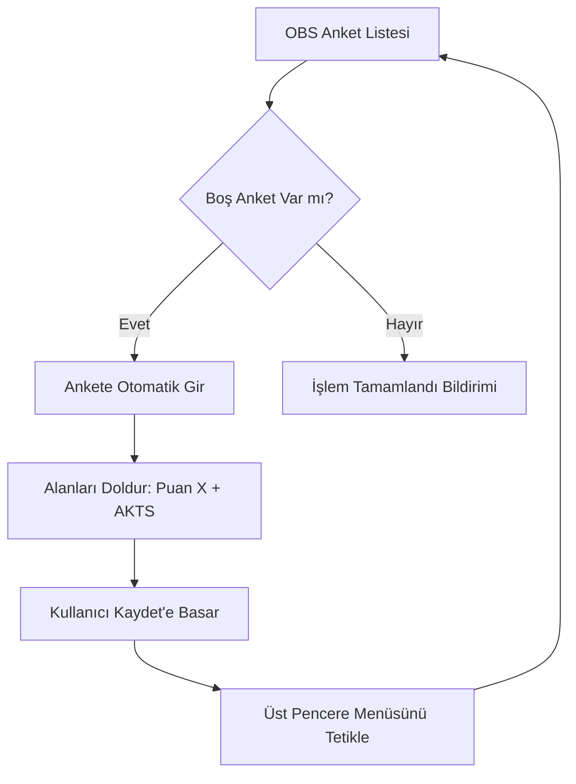

# Fırat OBS Otomatik Anket Çözücü 🚀

Fırat Üniversitesi Öğrenci Bilgi Sistemi (OBS) üzerindeki anketleri saniyeler içinde, tam otomatik bir akışla dolduran Manifest V3 tabanlı bir tarayıcı eklentisidir.

## 🏗️ Mimari ve Çalışma Prensibi

Proje, OBS'nin karmaşık iframe yapısı ve ASP.NET'in state yönetimi (Postback) dikkate alınarak **"Navigation & Observation Engine"** prensibiyle tasarlanmıştır.

### 1. NavigationEngine (Flow Control)
OBS anketlerinde, bir anket doldurulduktan sonra liste otomatik yenilenmez. Bu sorunu çözmek için eklenti:
- **Exit-Reenter Mantığı**: Anket kaydedildiği an, üst penceredeki (parent window) "Anketler" menüsünü manuel olarak tetikler. Bu, sistemin sayfayı yenilemesini ve listenin güncellenmesini sağlar.
- **Auto-Discovery**: Sayfa her yenilendiğinde "Doldurulmamış" anketleri tarar ve sıradaki uygun ankete otomatik giriş yapar.

#### Mimari Akış Şeması

### 2. Event Simulation Layer
Sadece DOM değerlerini değiştirmek, ASP.NET tabanlı sistemlerde verinin sunucuya gitmesine yetmez. Eklentimiz:
- Input değerini atadıktan sonra `input` ve `change` event'lerini baloncuklanma (bubbles) yöntemiyle tetikler.
- Sunucu, verinin gerçek bir kullanıcı tarafından girildiğini kabul eder.

---

## 🛠️ Kurulum Rehberi (Kesin Çözüm)

Eklentiyi yüklerken "Manifest file is missing" hatası almamak için aşağıdaki adımları sırasıyla uygulayın:

1. Tarayıcınızda (Chrome/Edge/Brave) `chrome://extensions/` adresine gidin.
2. Sağ üstteki **Geliştirici Modu**'nu (Developer Mode) açın.
3. **Paketlenmemiş öğe yükle** (Load unpacked) butonuna basın.
4. Bilgisayarınıza indirdiğiniz `firat_edu_tr_otomatik_anket_cozucu` klasörünü (ana klasörü) seçin.
   - *Not: `manifest.json` dosyası artık ana klasördedir. Doğrudan ana klasörü seçmeniz yeterlidir.*

---

## ⚡ Kullanım

1. OBS sistemine giriş yapın.
2. Eklenti ikonuna tıklayıp anket puanını (1-5) seçin.
3. **Genel İşlemler > Anketler** menüsüne gidin.
4. Eklenti ilk ankete girip dolduracaktır, tek yapmanız gereken "Kaydet"e basmaktır.

---

## 🤝 Katkıda Bulunma (Contributing)

Bu projeyi geliştirmek isterseniz:
- **Hata Bildirimi**: Issues kısmından ekran görüntüsü ile bildirebilirsiniz.
- **Yeni Özellik**: Pull Request (PR) gönderirken atomik commit yapısına ve teknik açıklamalara dikkat ediniz.
- **Hızlandırma**: `content_script.js` içindeki `CONFIG.autoFillDelay` değerini optimize edebilirsiniz.

---

> [!CAUTION]
> **UYARI**: Bu araç sadece otomasyon kolaylığı sağlar. Kullanım sorumluluğu kullanıcıya aittir.
